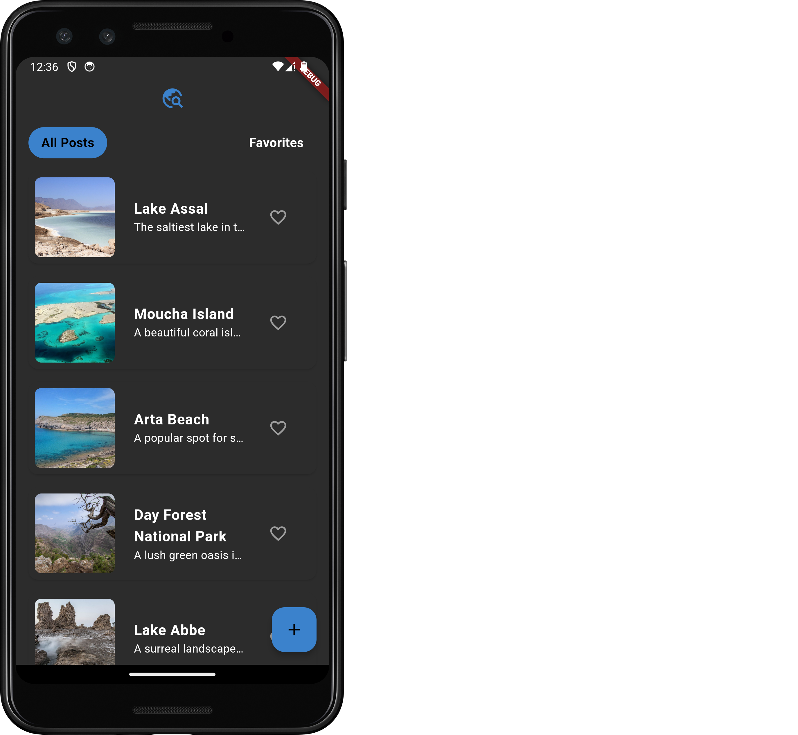
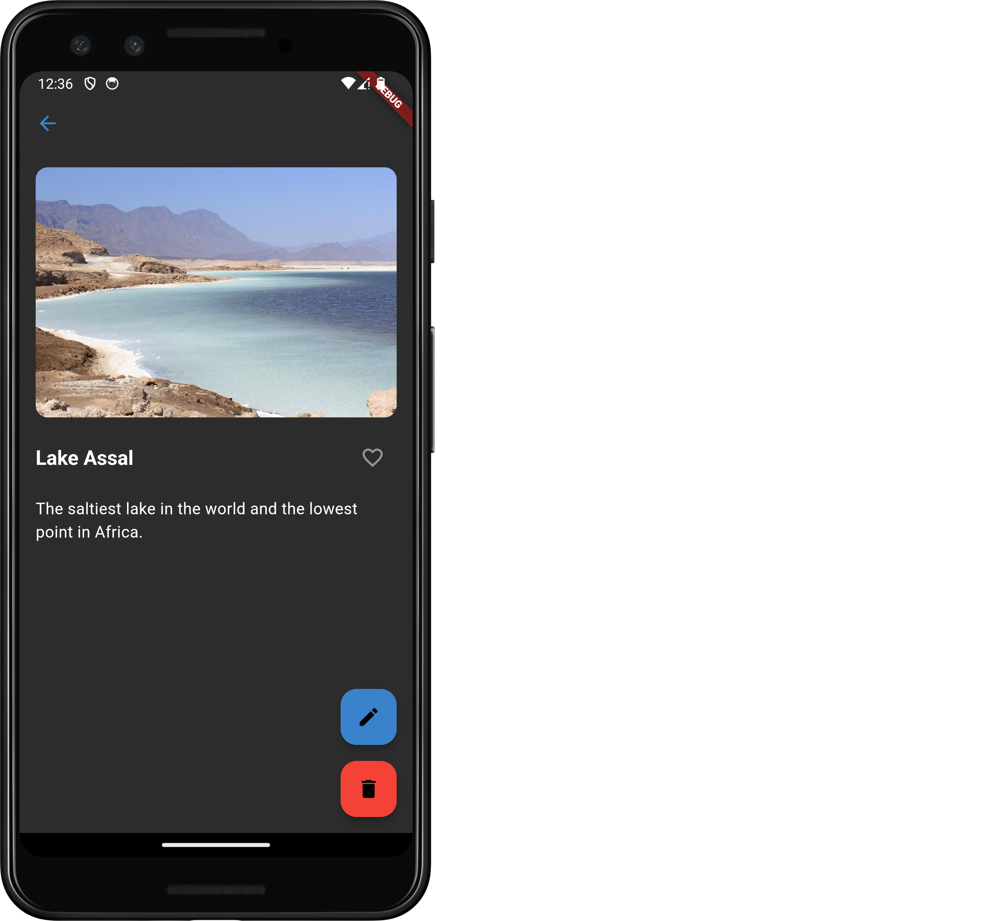
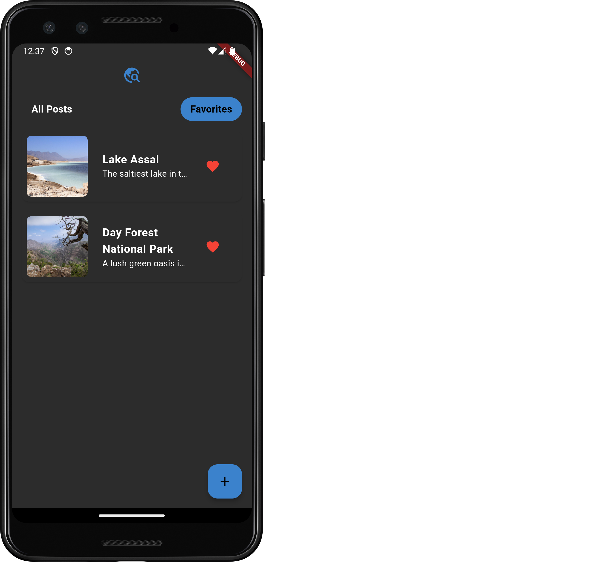
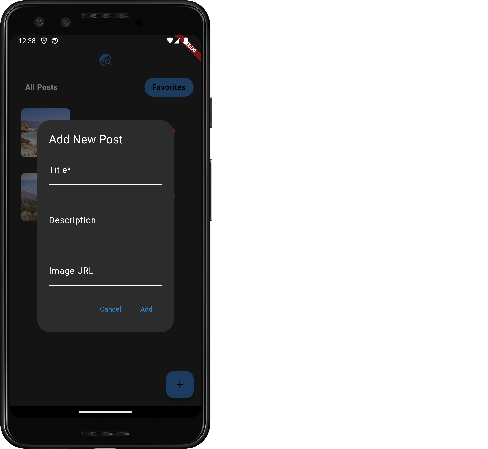
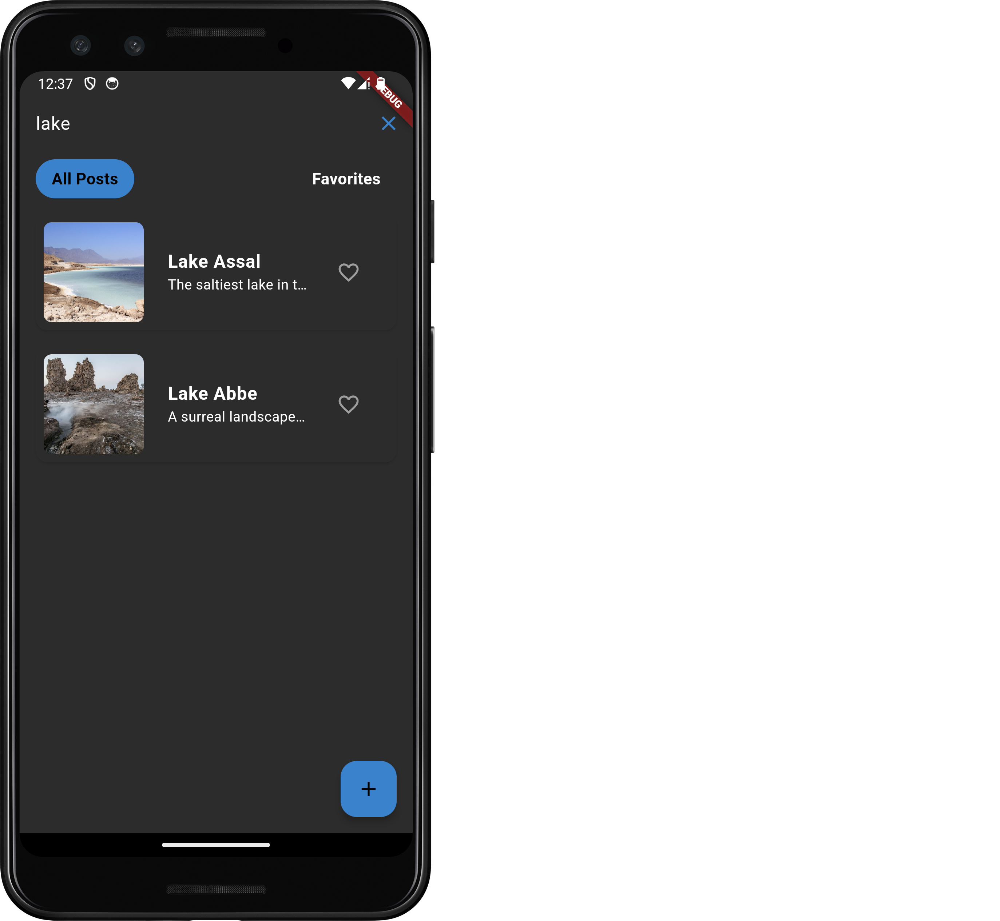
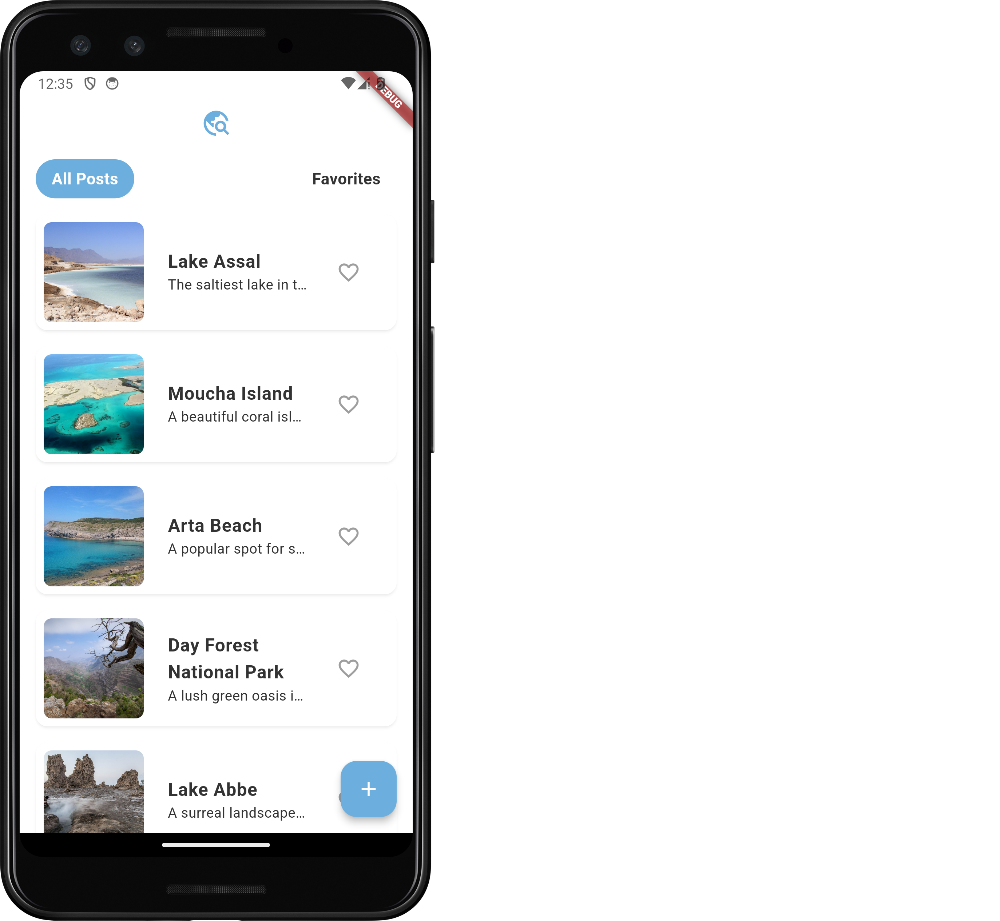
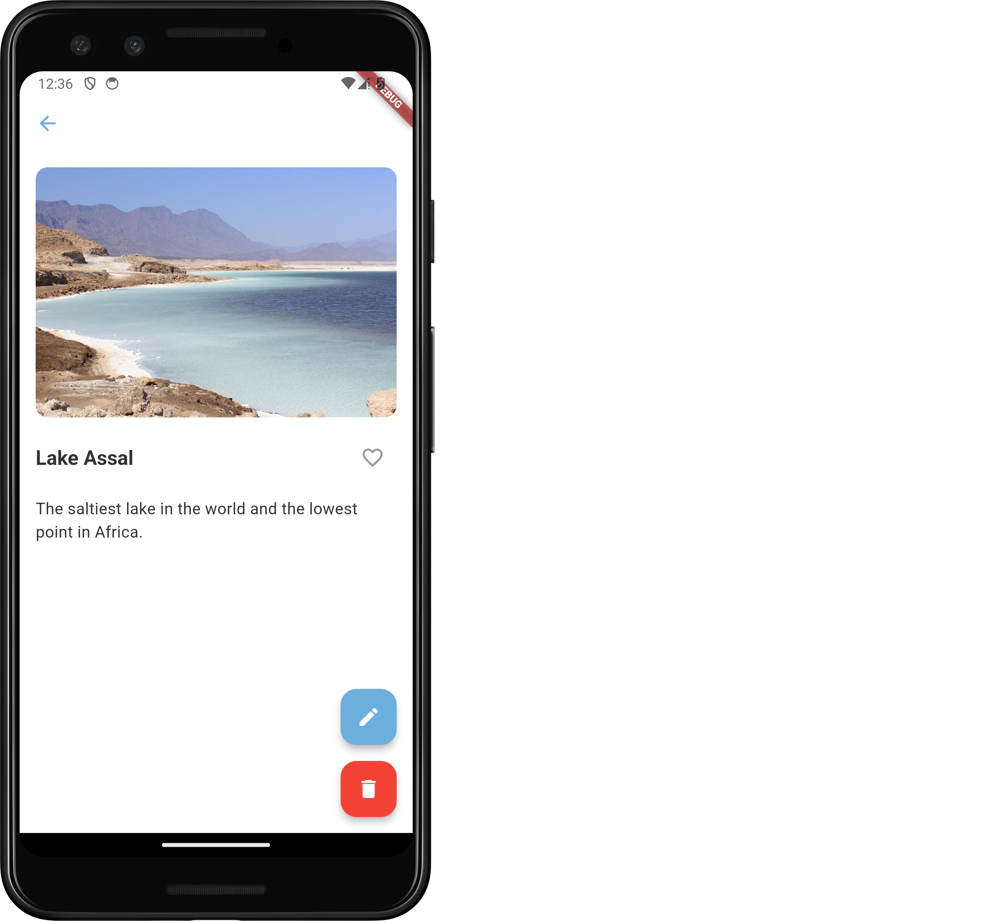

# Afarscape

Explore Djibouti's wonders with a modern travel app. Manage posts, discover destinations, and plan adventures seamlessly using Flutter.

## Features Implemented

### **Theme and Dark Mode**
- A dynamic light/dark mode theme has been implemented for a modern and accessible user interface.
- Themed components follow a clean, consistent design inspired by Material Design 3.
- Custom color schemes for both light and dark themes enhance the app's usability and aesthetics.

### **Favorite System**
- Users can mark posts as favorites with a simple tap on a heart icon.
- Favorite posts are highlighted, making it easy to revisit them later.
- Dedicated "Favorites" tab to view only favorite posts.

### **Image Display in Posts**
- Posts support images, which are displayed prominently in the UI.
- Placeholder images are used if an image fails to load, ensuring a consistent look and feel.

### **Search Posts**
- Search functionality allows users to find posts by title.
- Real-time search updates the displayed list of posts as users type.
- Clear and cancel search features for better usability.

### **Post Management**
- **Add Post**: Users can create new posts with a title, description, and optional image.
- **Update Post**: Existing posts can be edited seamlessly with updated details.
- **Delete Post**: Remove posts with confirmation dialogs to prevent accidental deletions.
- **Swipe Gestures**: Swipe actions enable quick editing or deletion of posts.

### **Robust State Management**
- Managed using the **Bloc** pattern for clean separation of concerns.
- Ensures predictable application state transitions and enhances scalability.
- All operations, including favorites, search, and CRUD actions, are handled efficiently via Bloc.

### **Domain-Driven Design (DDD) Architecture**
- The application follows DDD principles, separating the app into core domains for maintainability.
- Clear boundaries between presentation, domain, and data layers.

## Commands to Run the Project

Make sure you have Flutter installed. Then, run the following commands to get started:

```bash
flutter pub get
flutter pub run build_runner build
flutter run
```

## Screenshots

### **Dark Theme**






### **Light Theme**




More screenshots can be found in the `assets/screenshots` directory.


